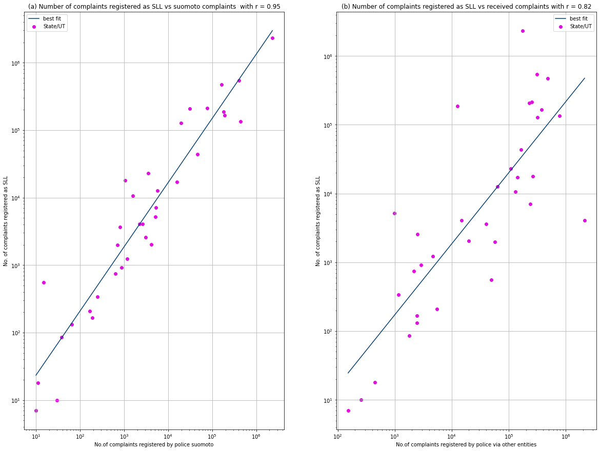
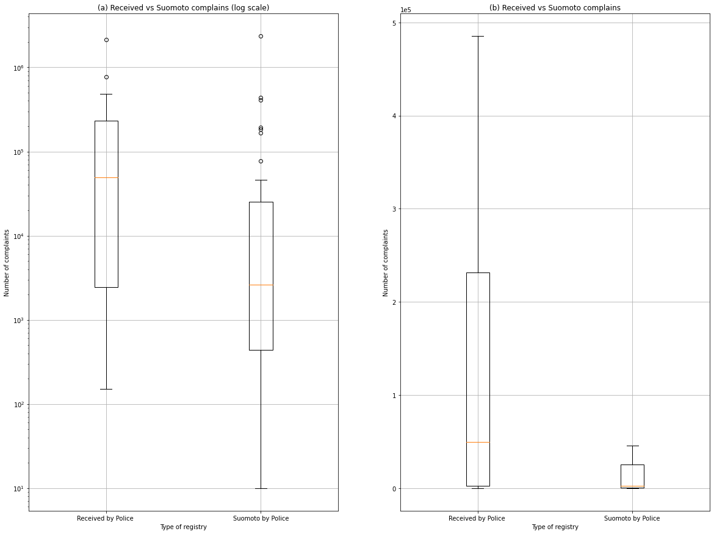
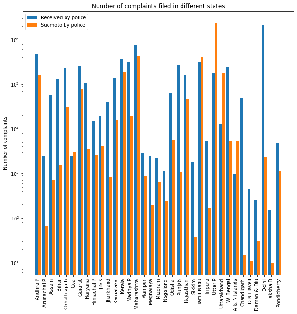

# DS200:Research Methods
* * *
## Module 4 : Assignment
* * *

> **AIM:- To download a dataset from www.data.gov.in and do the following**
>> Make a scatterplot,boxplot and barchart and draw inferences from it.

### Part1: - Dataset
> The dataset is downloaded from www.data.gov.in.

### Files
> All the files are contained in the zip folder **module4**
1.  **NCRB_2009_Table_1.1.csv** is the file containing all the data. The file is same as downloaded from website, only the names of states are shortened.
2.  **ds200_module4.py** is the file containing python code for the creating the graphs using _matplotlib_ library.
3.  Copy **ds200_module4.ipynb** in the **module4** folder if you want to use Jupyter Notebook.

### Part2: - Scatter Plot
> Below are two scatterplot.

1.  The plots contains the number of case registered by different means for the 28 states and 7 UT based on 2009 data.
2.  The X-axis on the plot contains the Number of complaints registered by police sumoto and Number of complaints registered via other entities.
3.  The Y-axis on the plot contains Number of cases registered as SLL.
4.  The regression line in plot (a) fits the data better than in plot (b). 

* * *

### Part2: - Box Plot
> Below are two boxplots.

1.  The plot on the left shows the box plot of **Number of complaints received by police** in two catergories. First the complaints which are submitted to police by other entities via oral,written means or using police helpline for all 35 states and U.Ts. Second are the complaints that are registered by police suomoto for all 35 states and U.Ts. The first boxplot shows the number of complaints on log scale along with the outliers.
2. The second boxplot shows the same data as (1) but on a linear scale without outliers.

* * *
### Part3: - Bar Chart
> Below is the Barchart which shows for all States and U.Ts (those that existed in 2009) how many complaints are filed by non law enforcers and suomoto by police.

1.  The Bar chart shows on log10 scale the **number of complaints**. The **blue** bar denoted the **number of complaints  received by police via oral/written/helpline** and the **red** bar denoted the **number of complaints filed suomoto by police** for all 35 states and U.Ts .

## References
<b id="my_anchor">[1].</b> National Crime Records Bureau- Ministry of Home Affairs,2009, _State/UT-wise Complaints received by Police & Cases registered under IPC & SLL during 2009_, electronic dataset,Open Government Data (OGD) Platform India, [https://data.gov.in/resources/stateut-wise-complaints-received-police-cases-registered-under-ipc-sll-during-2009](https://data.gov.in/resources/stateut-wise-complaints-received-police-cases-registered-under-ipc-sll-during-2009).

